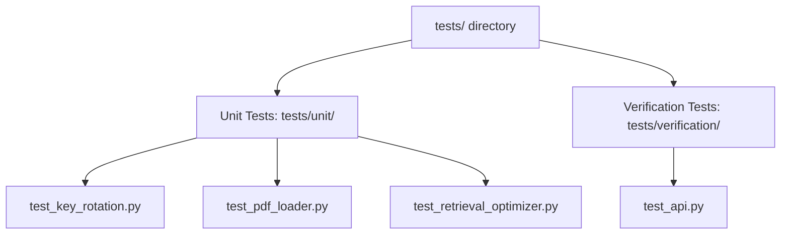

# EduMate-RAG Test Suite Documentation

This document provides a comprehensive overview of the testing infrastructure, test categorization, and execution guidelines for the EduMate-RAG system.

---

## 1. Test Suite Summary

The test suite consists of **22 automated tests**, all of which are configured to run locally without external service requirements (APIs are mocked out, and database connections are virtualized).

*   **Total Tests**: `22`
*   **Status**: `100% Passing`
*   **Execution Time**: `~5 seconds`
*   **Mocking**: Fully self-contained using `pytest` fixtures and mocks.

---

## 2. Test Categorization

The test suite is divided into two distinct categories:



### A. Unit Tests (`tests/unit/`)
Unit tests focus on isolating and verifying individual functions, classes, and logic blocks. External service layers (like the file system, network calls, or LLMs) are bypassed using unittest mocks.

*   **[test_key_rotation.py](file:///d:/College/Final%20Project/edumate/EduMate-RAG/tests/unit/test_key_rotation.py)**: Validates fallback/rotation logic for the Groq API keys when encountering rate limits (HTTP 429).
*   **[test_pdf_loader.py](file:///d:/College/Final%20Project/edumate/EduMate-RAG/tests/unit/test_pdf_loader.py)**: Ensures document processing, text splitting, and PDF extraction library fallback behaviors (`pypdf` vs `pymupdf`) function correctly.
*   **[test_retrieval_optimizer.py](file:///d:/College/Final%20Project/edumate/EduMate-RAG/tests/unit/test_retrieval_optimizer.py)**: Evaluates vector search relevance enhancement (similarity thresholds, Jaccard-based chunk deduplication, and keyword-overlap reranking).

### B. Verification / API Tests (`tests/verification/`)
Verification tests exercise API endpoints and data contract shapes using FastAPI's `TestClient` to ensure integrations with external layers (like a .NET gateway) remain stable.

*   **[test_api.py](file:///d:/College/Final%20Project/edumate/EduMate-RAG/tests/verification/test_api.py)**: Validates request/response schemas, parameter boundaries, error handlers, and defensive token capping rules on integration endpoints.

---

## 3. Detailed Test Catalog

| File | Test Function | Category / Target | Description / Verification Goal |
| :--- | :--- | :--- | :--- |
| **`tests/unit/test_key_rotation.py`** | `test_rotates_to_key2_on_rate_limit` | Groq Key Rotation | Validates that when the primary Groq API key hits a rate limit (HTTP 429), it switches to the backup key and succeeds. |
| | `test_both_keys_exhausted_raises` | Groq Key Rotation | Ensures that a `RuntimeError` is raised if both primary and secondary keys are rate limited. |
| | `test_no_key2_raises_immediately` | Groq Key Rotation | Checks that the system fails immediately if the secondary API key is unset and the primary key rate-limits. |
| | `test_non_rate_limit_error_propagates` | Groq Key Rotation | Assures standard HTTP or network errors (non-429) propagate directly instead of triggering key rotation. |
| **`tests/unit/test_pdf_loader.py`** | `test_pdf_loader_initialization` | Document Processing | Verifies default properties of the text splitter (e.g. chunk size = 1000, overlap = 200). |
| | `test_load_pdf_success` | Document Processing | Confirms basic PDF parsing via `pypdf` and accurate metadata formatting. |
| | `test_load_pdf_fallback` | Document Processing | Verifies automatic fallback to `pymupdf` if `pypdf` raises an extraction error. |
| | `test_load_all_pdfs` | Document Processing | Checks that all files matching the target glob are discovered and parsed recursively. |
| **`tests/unit/test_retrieval_optimizer.py`** | `test_filter_by_similarity_chroma_distance` | Retrieval Optimizer | Checks L2 distance conversion (`1 - dist/2`) and similarity filtering. |
| | `test_filter_by_similarity_direct` | Retrieval Optimizer | Ensures direct similarity scoring (Qdrant format) filters correctly. |
| | `test_rerank_by_relevance_keyword_overlap` | Retrieval Optimizer | Verifies Jaccard-based keyword-overlap sorting on raw retrieved chunks. |
| | `test_deduplicate_documents` | Retrieval Optimizer | Verifies text deduplication at a configured Jaccard threshold. |
| | `test_optimize_retrieval_full` | Retrieval Optimizer | Tests the sequence of filtering → reranking → deduplicating → selecting top-K. |
| **`tests/verification/test_api.py`** | `test_api_root` | FastAPI Endpoints | Checks that the root API index is online and responsive. |
| | `test_health_check` | FastAPI Endpoints | Verifies `/health` responds with system health metrics and current vector database document counts. |
| | `test_query_endpoint_success` | FastAPI Endpoints | Validates standard POST query flow returns the correct payload structure. |
| | `test_query_endpoint_validation_empty_question` | API Validation | Rejects requests containing blank or whitespace-only questions with a 400 Bad Request. |
| | `test_query_endpoint_validation_invalid_docs` | API Validation | Rejects context document numbers outside the [1, 10] range with a 400 Bad Request. |
| | `test_query_endpoint_rate_limit` | API Validation | Maps internal rate limit exceptions to a user-facing HTTP 503 error. |
| | `test_integration_query_success` | External Integrations | Assures the POST `/api/integrations/query` schema aligns with the .NET conversation model. |
| | `test_integration_query_caps_history_to_latest_five` | External Integrations | Checks that historical chat lists are defensively sliced to the most recent 5 turns before processing. |
| | `test_integration_query_validation_empty_user_id` | External Integrations | Ensures a missing `userId` payload attribute triggers a 400 Bad Request. |

---

## 4. How to Run Tests

### Prerequisites
Make sure the Python virtual environment is activated:
```bash
.venv311\Scripts\activate
```

### Run All Tests
Execute pytest from the root folder:
```bash
pytest -v
```

### Run a Specific File
Run tests inside a single module:
```bash
pytest tests/unit/test_retrieval_optimizer.py -v
```

### Code Coverage Analysis
Check testing coverage metrics:
```bash
pytest --cov=src --cov-report=term-missing
```

---

## 5. Test Infrastructure Details

The test suite relies on **[conftest.py](file:///d:/College/Final%20Project/edumate/EduMate-RAG/tests/conftest.py)** to prevent environment initialization side effects:
*   **Environment Variables**: Sets mock credentials (`GROQ_API_KEY`, `ADMIN_KEY`, etc.) automatically before config loads.
*   **Module Mocking**: Intercepts imports of database clients (`chromadb` and `qdrant_client`) so that no local installations or network resources are required during test execution.
